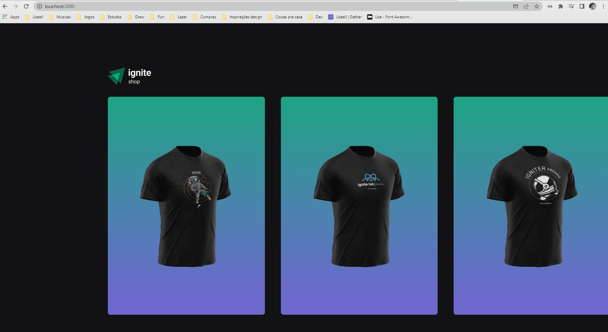

# NextJS - 04 Ignite Shop



## 📖 Sobre 

  Projeto de Ecommerce básico para trabalhar com o framework NextJS, utilizando também Stitches para desenvolver componentes estilizados e Stripe para realizar pagamentos, Keen slider para criar o slider e utilizando as API Routes do Next para garantir a segurança de seus dados.

## 🚀 Tecnologias

  - NextJS (12)
  - Stitches 
  - Stripe
  - KeenSlider


## 📦 Como baixar o projeto

   Clonar os repositórios

```bash
    $ git clone https://github.com/freitasDavi/04-ignite-shop

    # Instalar o node/npm

    # Instalar as dependencias

    $ npm install

    # Inicializar a aplicação

    $ npm run dev
```

Abrir [http://localhost:3000](http://localhost:3000) no seu navegador para ver o projeto.

---
This is a [Next.js](https://nextjs.org/) project bootstrapped with [`create-next-app`](https://github.com/vercel/next.js/tree/canary/packages/create-next-app).

--- 

## .env.local keys 
# STRIPE
STRIPE_PUBLIC_KEY=
STRIPE_SECRET_KEY=